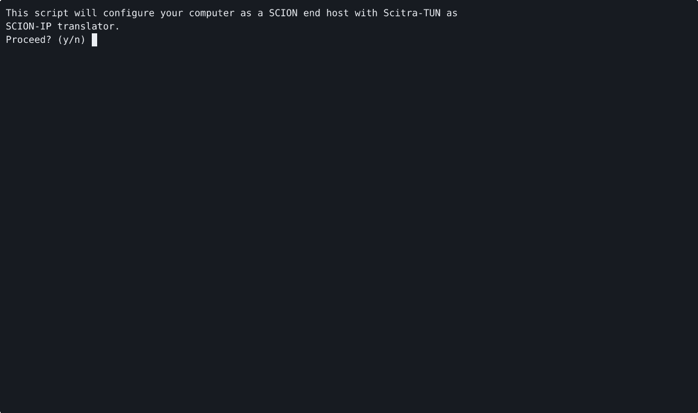

SCION and Scitra Bootstrap Script
=================================

A bash script that sets up an Ubuntu 24.04[^1] system as SCION host with support for seamless
IP-SCION interoperability using Scitra-TUN.

The script will:
- Set up the author's APT repository `https://lcschulz.de/scion/apt` on your machine.
- Install the SCION daemon and dispatcher, the *scion* command line tool, Scitra-TUN and the
  *scion2ip* command. The dispatcher is installed as a dependency for the daemon, but is *not*
  enabled or started by the script. Instead, the script patches the dispatcher dependency out of the
  daemon's systemd unit (with an override file), so that Scitra-TUN can listen on the SCION end host
  port instead. Scitra-TUN only translated SCMP echo requests arriving at the end host port, it does
  not dispatch packets to other ports. This is a deliberate design decision that avoids SCION
  traffic bypassing firewall rules.
- Optionally set up a Wireguard VPN through which SCION is accessed
- Download the TRC(s) and topology definition from a bootstrap server
- Optionally install a script that refreshes the TRC(s) and topology
- Optionally set up a systemd timer that periodically refreshes the TRC(s) and topology
- Configure Scitra-TUN
- Add a localhost.scion entry to /etc/hosts that maps to the host's SCION-mapped IPv6 address
- Optionally configure a DNS server for the domains `scion`, `scion.host`, and `scion.fast` that
  resolves SCION TXT records to to SCION-mapped IPv6 addresses for Scitra-TUN.
- Configure starting the optional Wireguard tunnel, the scion-daemon, and scitra-tun at boot.

If the setup is interrupted at any point it is safe to run the script again.

For more information on Scitra-TUN, see its [homepage](https://lcschulz.de/software/scitra-tun/).

[^1]: The repository the script gets SCION and Scitra from only has binaries for Ubuntu on amd64.
If you install SCION and Scitra from another source, the rest of the script should run on any Linux
distribution that uses systemd.

## Usage ##
Just download and run [bootstrap-scitra.bash](./bootstrap-scitra.bash). The script will
interactively guide you through the setup process.

Information you should have before you run the script:
- What SCION AS are you connecting to?
- What is the URL of the bootstrap server in your AS?
- Do you need a VPN to connect to your AS? The script can assist with setting up Wireguard if you
  have a *.conf file suitable for wg-quick.
- Is there NAT between your host and the rest of the AS? If so and your AS supports it, you should
  enable STUN when asked. If your AS does not support STUN and you are behind NAT, SCION will
  unfortunately not work.
- If you have a NAT and need to enable STUN, do the border routers in your AS support multiplexed
  STUN or do they run standalone STUN servers at some other port?
- If your AS is using IPv6, your host must have a routable SCION-mapped IPv6 address (with prefix
  fc00::/8) and some additional routing settings are required. Please read the
  [Scitra-TUN man page](https://github.com/lschulz/scion-cpp/blob/main/scitra/man/scitra-tun.8.md)
  for more details.

The script contains a small database of known bootstrap servers.
Currently known are:
- 71-2:0:4a OvGU Magdeburg at https://ovgu.bootstrap.scion.host

## For SCION AS Operators: AS Requirements ##
In order for an AS to work with Scitra and this scripts, it must:
- Run at least [scionproto/SCION](https://github.com/scionproto/scion) v0.14.0.
  Other implementations of SCION may work but have not been tested.
- Provide a bootstrap server. The bootstrap server is a simple webserver that hosts the ISD's TRC
  and an up-to-date `topology.json` file. A [simple test bootstrap][1] server is available in
  Python. A more complete solution is the [SCION Orchestrator][2]. Alternatively, any web
  server with the [right directory structure][3] will do.
- Either run its internal network on IPv4 or if using IPv6, provide AS-internally routable
  SCION-mapped IPv6 addresses to SCION clients.

[1]: https://github.com/lschulz/scion-bootstrap-server
[2]: https://github.com/scionproto-contrib/scion-orchestrator
[3]: https://github.com/netsec-ethz/bootstrapper?tab=readme-ov-file#nginx-web-server

Additionally, it is recommended that ASes offer a way for clients to work around NAT issues.
This can be any combination of the following:
- A Wireguard VPN with addresses that are routable to the SCION border routers.
- STUN servers colocated with the border routers or border routers that can answer STUN binding
  requests multiplexed on the same port as used for regular SCION packets. The second option is
  not implemented in any SCION router known to the author, so separate STUN servers are recommended.
- Use IPv6 in the AS-internal network to avoid NAT. This is the most complex option as it requires
  setting up SCION-mapped IPv6 addresses.

If you want to add your network to the list of supported SCION ASes, please open a pull request.

## Known ASes ##

### 71-2:0:4a OvGU Magdeburg ###
- Internal network: IPv4
- Bootstrap server at https://ovgu.bootstrap.scion.host
- The control service and border routers are reachable from the public Internet. For better privacy
  when connecting remotely you can use [eduVPN](https://pit.ovgu.de).
- If you don't have a public IPv4 address (or you are using eduVPN), you must enable STUN in Scitra.
- STUN is provided by border routers and SCION servers at UDP port 3478.
- SCION applications that do not support NAT traversal will likely not work.
